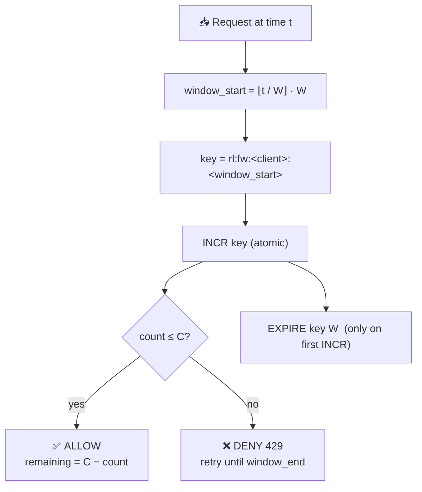
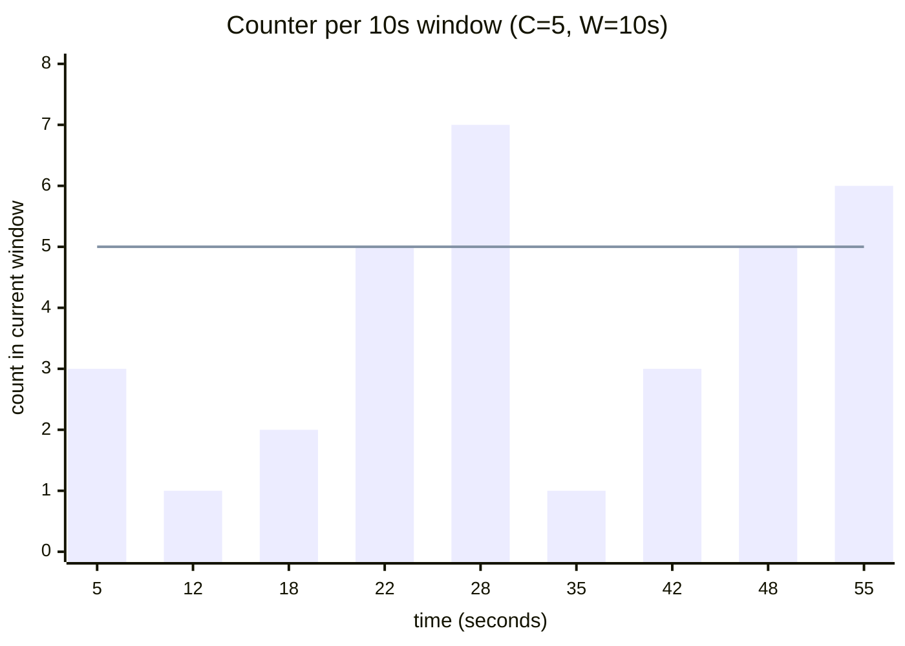
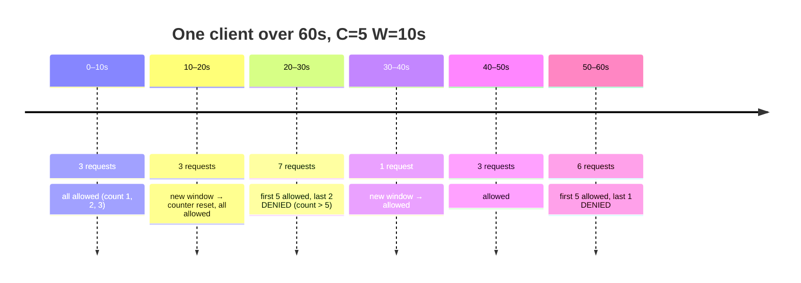
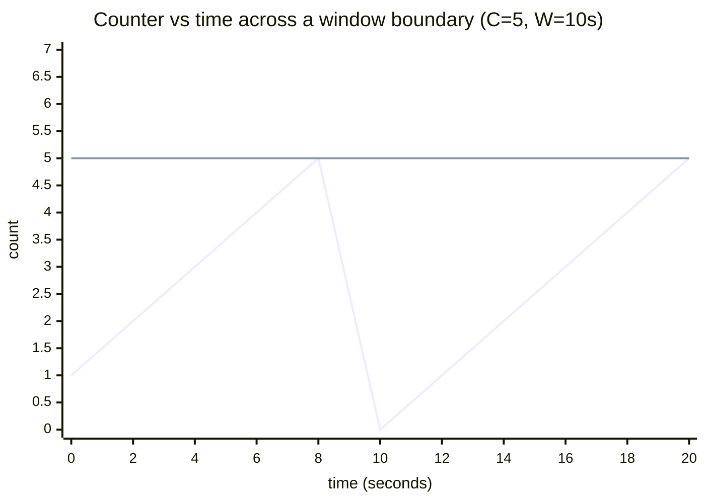
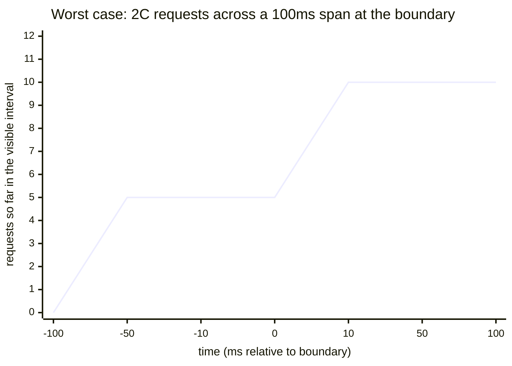
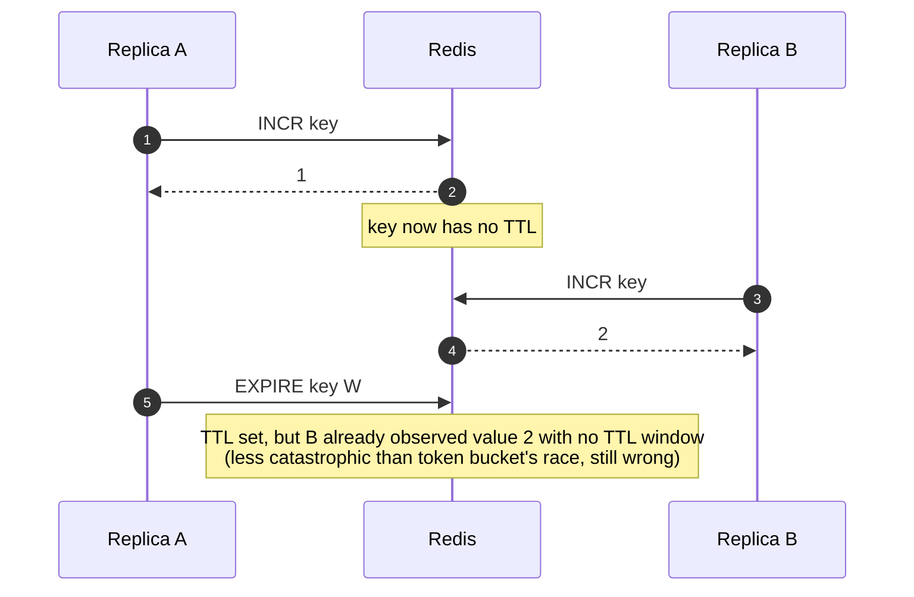
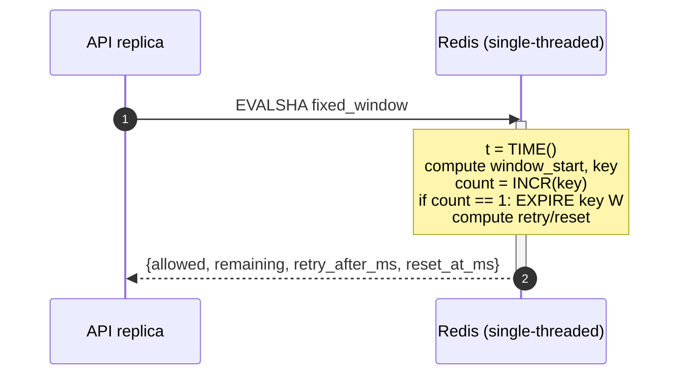

# Fixed Window Counter

> The simplest algorithm: chop time into equal slices, count requests per slice,
> reject when the count exceeds the limit. Two Redis commands, one round trip.

---

## 1. The mental model

Time is divided into back-to-back **windows** of length `W` seconds. Each
window has its own counter, identified by the window's start timestamp.
Each request `INCR`s the counter for the *current* window. If the result
exceeds `C`, deny.



The whole thing is essentially `INCR + EXPIRE`. That's why it's the
fastest of the four algorithms.

---

## 2. Visual: a 60-second timeline

`C = 5`, `W = 10s`. Each colored block is one window; the bar height is
the count after each request.



(The horizontal line is the limit `C=5`. Bars at or below it pass; bars
above it represent denied requests — Redis still increments the counter,
the script just returns `allowed=0`.)



Notice the windows are **independent**. The boundary at `t=20s` resets the
counter to zero — which is both the algorithm's chief virtue (cheap, simple)
and its chief flaw (see §3.5).

---

## 3. The math, from first principles

### 3.1 Window assignment

Given any timestamp `t` (in seconds), the window it belongs to has start:

$$\text{window\_start} = \left\lfloor \frac{t}{W} \right\rfloor \cdot W$$

The redis key encodes the bucket `(client, window_start)`:

$$\text{key} = \texttt{rl:fw:<client>:} \lfloor t / W \rfloor$$

Two requests are in the **same** window iff they share this key. There is
no overlap, no carry-over: at `t = window_start + W`, a brand-new key
springs into existence and the counter starts fresh at 0.

### 3.2 The increment

Redis `INCR` is atomic. It returns the **new** value. So the entire
allow/deny decision is one operation:

$$\text{count} \leftarrow \text{INCR}(\text{key})$$

$$\text{allowed} = (\text{count} \leq C)$$

If `count == 1`, this was the first request in this window — set `EXPIRE key W`
so the counter auto-cleans `W` seconds later. (Subsequent calls in the same
window must NOT refresh the TTL — that would extend the window indefinitely
under continuous load. See §4.)

### 3.3 `remaining`

$$\text{remaining} = \max(0,\ C - \text{count})$$

Clamped at 0 because `count` may exceed `C` on denied requests (the script
still increments — see §3.6 for why).

### 3.4 `retry_after_ms` and `reset_at_ms`

Both are anchored to the **window boundary**, not to a continuous refill rate:

$$\text{window\_end\_ms} = (\text{window\_start} + W) \cdot 1000$$

$$\text{retry\_after\_ms} = \text{window\_end\_ms} - now_{ms}$$

$$\text{reset\_at\_ms} = \text{window\_end\_ms}$$

For fixed-window, `retry_after_ms == reset_at_ms - now_ms` always — there's
no notion of "one token regenerates earlier than the bucket fully refills."
The whole quota refreshes atomically at the window flip.



The vertical drop at `t=10s` is the window flip. Until that moment, every
request after the 5th in the first window is denied with `retry_after_ms`
counting down toward 10s.

### 3.5 The boundary burst (the famous flaw)

Fixed-window's known weakness: a client can land `C` requests right before
the boundary and another `C` immediately after — **2C requests in a tiny
real-time interval**, even though both windows individually obeyed the limit.



(Five requests fired in the last 100ms of window N; another five in the first
100ms of window N+1. Total: 10 requests in 200ms, with `C=5, W=10s` — i.e.
**4× the configured rate** sustained over a 200ms slice.)

Bound on this misbehavior:

$$\text{burst}_{\max} = 2C \quad \text{(within an arbitrarily small interval near the boundary)}$$

Long-run rate is still `C/W` (the proof is the same shape as token bucket's),
but smoothness is **not** a property fixed-window provides. If your endpoint
needs smooth throughput, use sliding-window or leaky-bucket instead.

This is the exact problem that **sliding-window log** solves (next algorithm
in this codebase) — at the cost of O(N) memory per client.

### 3.6 Why we INCR even on denied requests

A naive optimization would be: "check first, increment only if allowed."
This breaks atomicity. Two replicas running simultaneously:

```
Replica A: GET → 5 (would deny, no INCR)
Replica B: GET → 5 (would deny, no INCR)
```

Both observe the same `5`. If we don't increment on the deny path, the
counter never rises above 5 even under massive overload — meaning it
*looks* like the limit is being respected when it isn't.

By unconditionally `INCR`ing and *then* deciding, the counter accurately
reflects attempted load. We cap response semantics at `count > C` but the
counter itself is honest. This is also why `remaining` uses `max(0, …)`.

---

## 4. State on disk (Redis)

Single string (Redis counter), one per `(client, window_start)`:

```
STRING  rl:fw:<client>:<window_idx>   value = count (int)
EXPIRE  W                              # set only on first INCR
```

**Why TTL is exactly `W` (not `2W` like token bucket):**
The key is **only meaningful** until `window_end`. After that, a new key
takes over. There is no "cool-down state" to preserve. The minimum TTL
that keeps the key alive for the rest of the window is `W` (set when
`count == 1`, i.e., at the start of the window).

**Why we don't refresh the TTL on subsequent INCRs:** under continuous
load, every request would push the expiry forward, and the key would
outlive its window. The counter must die exactly at `window_end` so that
the next `INCR` (in the next window) sees a key that doesn't exist and
implicitly starts at 1.

---

## 5. Why Lua, why atomic

`INCR` alone is atomic. So is `EXPIRE`. But the *pair* — "INCR, then if
this was the first call, EXPIRE" — needs to run as a unit:



More importantly, computing `retry_after_ms` from `now_ms - window_start_ms`
needs a Redis-supplied clock to stay consistent across replicas (same
argument as token bucket §6).

So we wrap the whole thing in Lua:



One round trip, zero races, all clock math centralized.

---

## 6. Walkthrough of the planned Lua script

```lua
local key_prefix = KEYS[1]      -- e.g. "rl:fw:client123"
local capacity   = tonumber(ARGV[1])
local window_s   = tonumber(ARGV[2])

local t = redis.call('TIME')
local now_ms       = tonumber(t[1]) * 1000 + math.floor(tonumber(t[2]) / 1000)
local now_s        = tonumber(t[1])
local window_idx   = math.floor(now_s / window_s)
local window_start = window_idx * window_s
local window_end_ms = (window_start + window_s) * 1000

local key = key_prefix .. ':' .. window_idx
local count = redis.call('INCR', key)
if count == 1 then
    redis.call('EXPIRE', key, window_s)
end

local allowed        = 0
local retry_after_ms = 0
if count <= capacity then
    allowed = 1
else
    retry_after_ms = window_end_ms - now_ms
end

local remaining = capacity - count
if remaining < 0 then remaining = 0 end

return {allowed, remaining, retry_after_ms, window_end_ms}
```

Reading the same map as the token bucket script:

| Step | What it does |
|------|--------------|
| `TIME()` | Single source of truth for clock — ignores client/replica clocks |
| `floor(now_s / W)` | Maps any timestamp to its window index |
| `key_prefix .. ':' .. window_idx` | Includes the window in the key — old windows naturally expire |
| `INCR` | Atomic counter increment, returns new value |
| `if count == 1 then EXPIRE` | Only the first call sets TTL — keeps the boundary honest |
| `count <= capacity` | The decision |
| `window_end_ms - now_ms` | Time until the quota refreshes |
| `max(0, capacity - count)` | Honest counter, clamped response |

Key choice (`key_prefix` from Python, `:window_idx` appended in Lua): this
keeps the Python side ignorant of windowing math. The middleware just
hands in the prefix; the algorithm owns the mapping from time to keys.

---

## 7. Comparison to token bucket

| Property | Token Bucket | Fixed Window |
|---|---|---|
| Memory per client | 1 hash, 2 fields | 1 string, transient (≤ W) |
| Commands per request | 1 EVALSHA → ~3 internal | 1 EVALSHA → 2 internal |
| Burst behavior | Up to `C` smoothly amortized | Up to **`2C`** at boundaries |
| Long-run rate | `C / W` | `C / W` |
| Fairness | Smooth | Bursty at window flips |
| Best for | APIs tolerating bursts (search, reads) | Hot paths where simplicity > smoothness |
| Worst case | Bounded by `C` | Bounded by `2C` (boundary effect) |

Both are atomic. Both are correct. The choice is about the **shape** of
the burst the API wants to allow.

---

## 8. Cheat sheet

| Quantity | Formula |
|---|---|
| Window index | `⌊t / W⌋` |
| Window start (s) | `⌊t / W⌋ · W` |
| Window end (ms) | `(window_start + W) · 1000` |
| Key | `rl:fw:<client>:<window_idx>` |
| Count after request | `INCR(key)` (atomic) |
| Allowed | `count ≤ C` |
| Remaining | `max(0, C − count)` |
| Retry-after (ms) | `window_end_ms − now_ms` |
| Reset (ms) | `window_end_ms` |
| TTL | `W` seconds, set only on first `INCR` |
| Long-run rate | `C / W` req/s |
| Worst-case burst | **`2C`** in a sub-window interval at the boundary |

That's the whole algorithm. Three formulas, two Redis commands, one
boundary flaw to be aware of.
