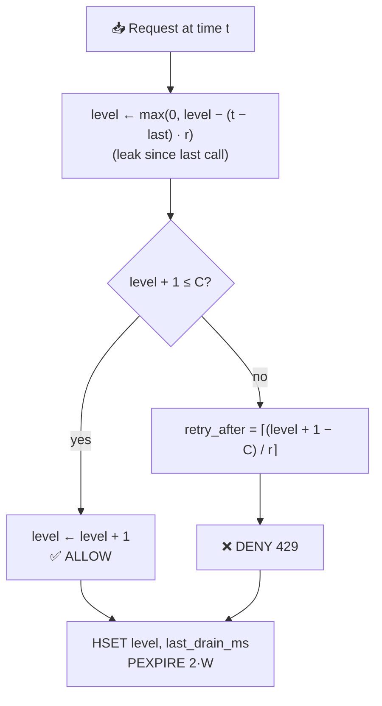
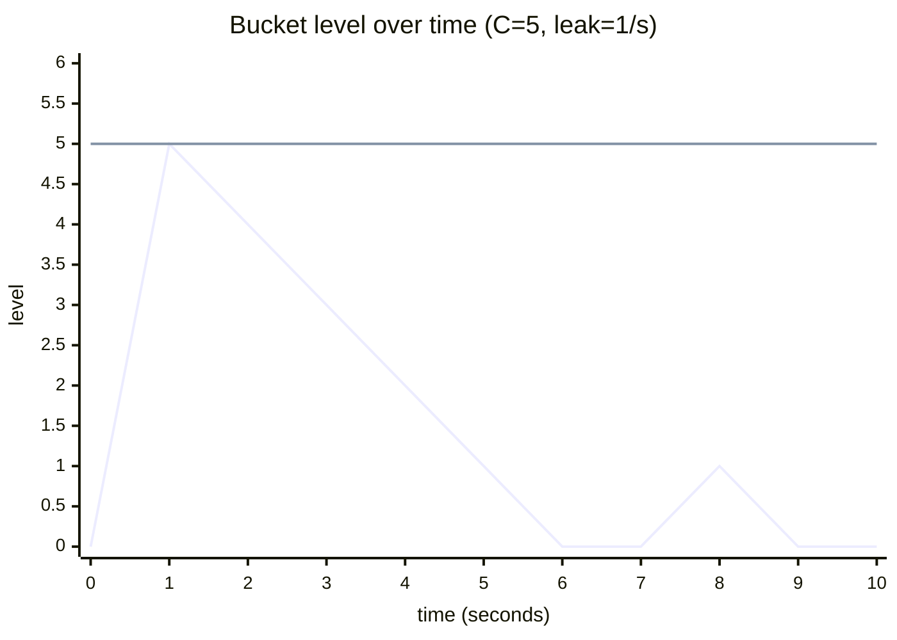
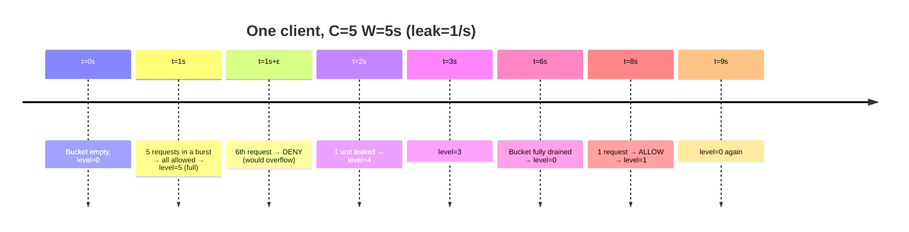
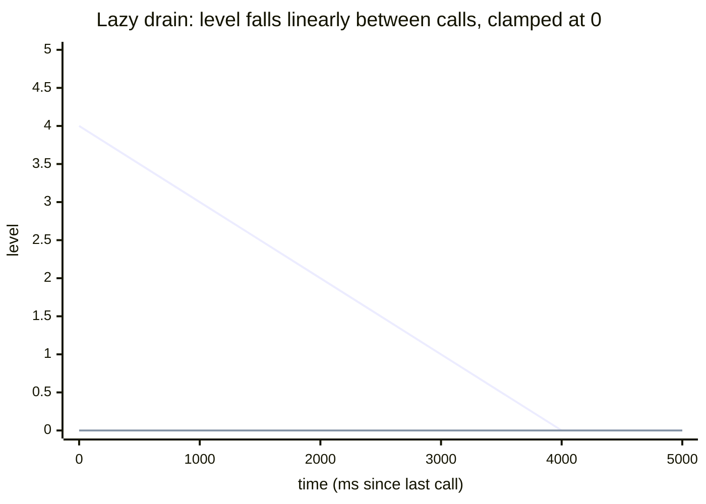
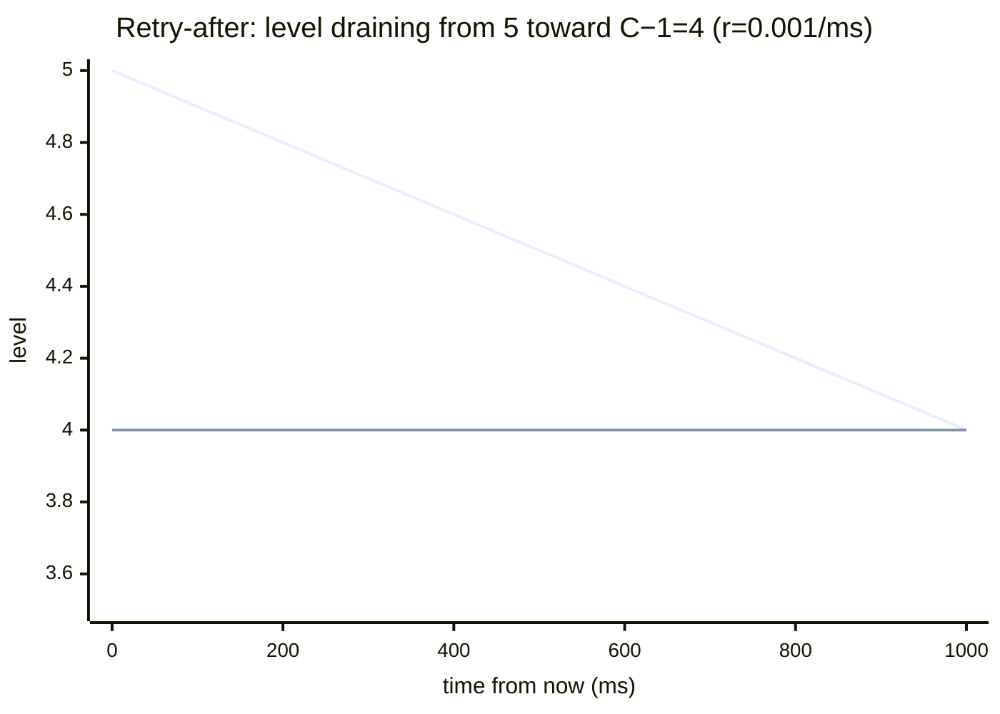
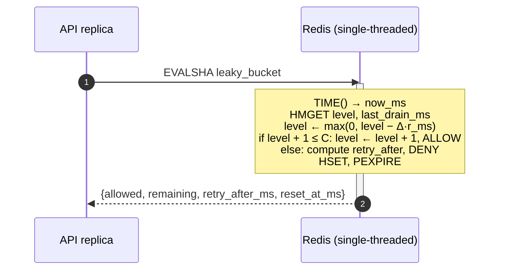

# Leaky Bucket

> A bucket that **fills** with requests and **leaks** at a constant rate.
> Deny when the bucket would overflow. Mathematically dual to token bucket;
> different intuition, same atomic Lua mechanics.

---

## 1. The mental model

Picture water pouring into a bucket. Each request adds **1 unit of water**.
The bucket leaks at a constant rate of `r = C / W` units per second
(same `C` and `W` as the other algorithms). If a new request would cause
the bucket to overflow past capacity `C`, it is denied.



**Two ways to think about it:**
- *Token bucket asks:* "How many tokens do I have left?" (`tokens` counts down toward 0)
- *Leaky bucket asks:* "How full am I?" (`level` counts up toward `C`)

The two algorithms are **duals** — `level = C − tokens` at every moment.
Same allow/deny decisions. We keep both because:
1. The mental model fits different problem framings (consumer-facing
   *"smooth my output"* vs producer-facing *"tank my surplus"*).
2. It's an explicit demonstration of the Strategy pattern — switching
   algorithms must change zero call sites.

---

## 2. Visual: filling and leaking

`C = 5`, `W = 5s` (so `r = 1 unit/sec`, leaks 1 unit per second).



(Filled to 5 by a 5-request burst at `t=1s`. Then leaks at 1/sec back to 0.
A single request at `t=8s` lifts level to 1, leaks back to 0 by `t=9s`.)



---

## 3. The math, from first principles

### 3.1 The leak rate

Same shape as token bucket's refill, but going **down** instead of up:

$$r = \frac{C}{W} \quad \text{units per second}, \qquad r_{ms} = \frac{C}{W \cdot 1000}$$

### 3.2 Lazy drain

We don't run a background timer. We store `last_drain_ms` and compute the
leak only when a request arrives — same trick as token bucket §3.2:

$$\text{level}_{new} = \max(0,\ \text{level}_{old} - (now - last) \cdot r_{ms})$$

`max(0, …)` clamps the floor — the bucket can't be more empty than empty.
Compare to token bucket's `min(C, …)` ceiling: the two are mirror images.



### 3.3 The decision

After the drain, we ask whether the bucket has room for one more unit:

$$\text{allowed} = (\text{level} + 1 \leq C)$$

If allowed: `level ← level + 1`. If denied: `level` stays put.

Note this is **not** "deny when level ≥ C" — it's "deny when adding 1
would overflow". Subtle but important: a bucket exactly at `C` should
deny; a bucket at `C − 1` should allow (the new entry brings it to `C`).

### 3.4 `retry_after_ms`

When denied, how long until there's room for one more unit?

The bucket needs to leak from `level + 1` down to `C` (i.e., down to
having one slot free):

$$\text{retry\_after\_ms} = \left\lceil \frac{(\text{level} + 1) - C}{r_{ms}} \right\rceil$$

Equivalently: leak by `level - (C - 1)` units. Same number, different framing.



(The two lines cross at `t = 1000ms` — that's when the bucket has room
for one new unit. Earlier retries would still be denied.)

`ceil` for the same reason as token bucket: avoid telling the client to
come back too early and get denied a second time.

### 3.5 `reset_at_ms`

When will the bucket be empty again?

$$\text{reset\_at\_ms} = now + \left\lceil \frac{\text{level}}{r_{ms}} \right\rceil$$

This is the answer to "when am I unburdened?" — useful for the
`X-RateLimit-Reset` header (informational).

### 3.6 Long-run rate

Same proof shape as token bucket. The bucket can hold at most `C` units;
it drains at rate `r`. So total throughput in time `T_total` is bounded:

$$\text{requests} \leq T_{total} \cdot r + C$$

For large `T_total`, the rate converges to `C / W`. Burst is bounded by `C`.
**Identical guarantees to token bucket — by construction.**

### 3.7 Why we keep both algorithms

If they're mathematically dual, why not pick one and ditch the other?

- **Pedagogy.** The portfolio framing (see CLAUDE.md) wants four algorithms,
  not three. Dropping leaky bucket would leave the chapter incomplete.
- **API ergonomics.** Some metering APIs (especially traffic shaping in
  networking — ATM, GCRA) think in "level" terms natively. Exposing
  leaky bucket as a first-class option lets users pick the model that
  matches their problem framing.
- **Operational dashboards.** Observability is easier when the exposed
  metric reflects reality. If your team thinks of rate-limiting as
  *"how full is each client's bucket"*, leaking up toward C reads more
  intuitively than token bucket's "running on empty".

Functionally, the choice is cosmetic. The Strategy pattern is the
infrastructure that makes "cosmetic" cheap.

### 3.8 Note: the *queue* formulation (and why we don't use it)

Classic textbook leaky bucket uses an actual FIFO queue:
- Requests `RPUSH` onto a list.
- A background drainer pops at rate `r`.
- The queue has max length `C`; overflow → deny.

This **smooths output** — accepted requests are released at constant `r`,
absorbing inbound bursts.

We don't implement this here because:
1. **HTTP doesn't queue.** A 200 OK that took 30 seconds because we held
   it in a leaky-bucket queue is worse UX than a fast 429.
2. **It needs a separate worker** (the drainer), violating the
   single-Lua-script invariant for the data path.
3. **Async/event-driven systems already smooth output** at the
   application layer — re-implementing it inside the rate limiter
   duplicates work.

The meter formulation (above) gives the same allow/deny rate without
needing a drainer process.

---

## 4. State on disk (Redis)

```
HASH  rl:lb:<client>:<endpoint>
  ├─ level          float    # current fill, 0 ≤ level ≤ C
  └─ last_drain_ms  int      # epoch ms of last call

PEXPIRE  2 × W × 1000   # auto-evict abandoned buckets, refreshed each call
```

Same TTL reasoning as token bucket: a fully-drained bucket (`level = 0`)
is indistinguishable from a fresh one, so storing it past `2W` is wasted
memory. `2W` (not `W`) gives a safety margin so a returning-after-window
client doesn't get a confusingly fresh state mid-flight.

---

## 5. Why Lua, why atomic

Same race as token bucket — "read level, compute, write level" is a
classic check-then-act pattern. Two replicas reading the same `level`
both decide to allow, both write the same incremented value, capacity
silently exceeded.



Same atomicity argument. Same single-source-of-clock argument
(`redis.call('TIME')`). Same correctness story as the prior three
algorithms — leaky bucket is an inversion, not a different correctness
domain.

---

## 6. Walkthrough of the planned Lua script

```lua
local key      = KEYS[1]
local capacity = tonumber(ARGV[1])
local window_s = tonumber(ARGV[2])

local leak_per_ms = capacity / (window_s * 1000)

local t = redis.call('TIME')
local now_ms = tonumber(t[1]) * 1000 + math.floor(tonumber(t[2]) / 1000)

local state = redis.call('HMGET', key, 'level', 'last_drain_ms')
local level = tonumber(state[1])
local last  = tonumber(state[2])

if level == nil then
    level = 0
    last  = now_ms
else
    local elapsed = now_ms - last
    if elapsed > 0 then
        level = math.max(0, level - elapsed * leak_per_ms)
        last  = now_ms
    end
end

local allowed        = 0
local retry_after_ms = 0
if level + 1 <= capacity then
    level   = level + 1
    allowed = 1
else
    retry_after_ms = math.ceil((level + 1 - capacity) / leak_per_ms)
end

local reset_at_ms = now_ms + math.ceil(level / leak_per_ms)

redis.call('HSET',    key, 'level', level, 'last_drain_ms', last)
redis.call('PEXPIRE', key, window_s * 2000)

local remaining = capacity - level
if remaining < 0 then remaining = 0 end

return {allowed, math.floor(remaining), retry_after_ms, reset_at_ms}
```

| Step | What it does |
|---|---|
| `leak_per_ms = C / (W·1000)` | Drain rate, same shape as token bucket's refill |
| `TIME()` | Single-source clock |
| `HMGET level, last_drain_ms` | One round trip for both fields |
| First-sight branch | Empty bucket: `level=0`. No tokens-vs-level mismatch — both algorithms agree on the friendly fresh state |
| Lazy drain | `max(0, level − Δ·r_ms)` — clamps at 0 |
| Decision | `level + 1 ≤ C` (strict-less-than-or-equal: a bucket at exactly `C` denies the next request) |
| Retry-after | `⌈(level + 1 − C) / r_ms⌉` |
| Reset | `now + ⌈level / r_ms⌉` |
| `PEXPIRE 2·W` | Same self-cleanup as token bucket |
| Return `floor(remaining)` | Integer count for the client; level is a float internally |

---

## 7. Comparison: all four algorithms

| Property | Token Bucket | Fixed Window | Sliding Window Log | Leaky Bucket |
|---|---|---|---|---|
| Memory per client | hash, 2 fields | int, transient | **N entries** (≤ C) | hash, 2 fields |
| Commands per request | ~3 | 2 | 3–5 | ~3 |
| Long-run rate | `C/W` | `C/W` | `C/W` | `C/W` |
| Worst burst in any W-interval | `C` | **`2C`** | `C` (tight) | `C` |
| Mental model | "tokens left" | "this minute's count" | "log of last W seconds" | "how full am I" |
| Boundary effect | none | yes | none | none |
| Best for | bursty reads | hot paths, simplicity | strict per-window SLAs | metering, traffic shaping mental model |
| Dual of | leaky bucket | (none) | (none) | token bucket |

If forced to pick one default for general use: **token bucket** (cheapest
state, friendliest to clients). Pick **sliding-window-log** for billing
or strict per-second contracts. Pick **fixed-window** when you need the
simplest possible thing. Pick **leaky-bucket** when your team's
operational vocabulary is already "fill/drain".

---

## 8. Cheat sheet

| Quantity | Formula |
|---|---|
| Leak rate (per ms) | `r_ms = C / (W · 1000)` |
| Level after drain | `max(0, level − (now − last) · r_ms)` |
| Allowed | `level + 1 ≤ C` |
| New level (allowed) | `level + 1` |
| Retry-after when denied | `⌈(level + 1 − C) / r_ms⌉` |
| Reset (bucket empty) | `now + ⌈level / r_ms⌉` |
| Remaining | `max(0, ⌊C − level⌋)` |
| Long-run rate | `C / W` |
| Max burst | `C` |
| TTL | `2 · W` seconds, refreshed each call |
| Dual of | token bucket (`level = C − tokens`) |
