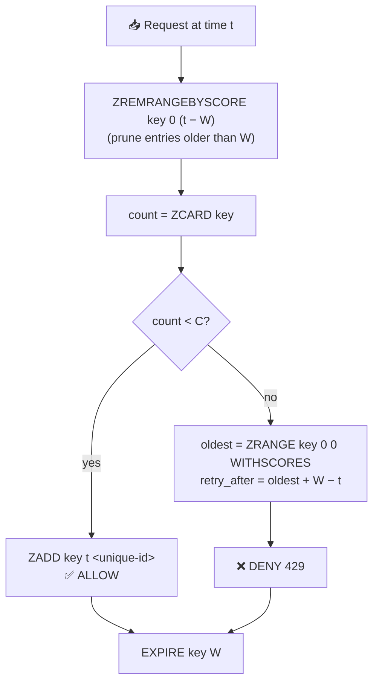
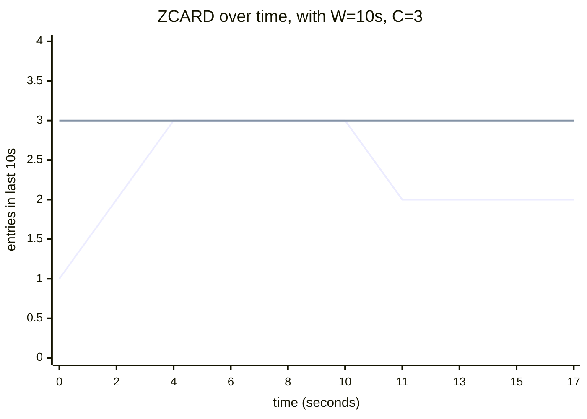
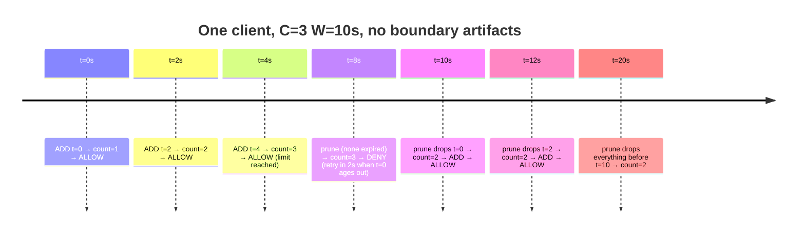
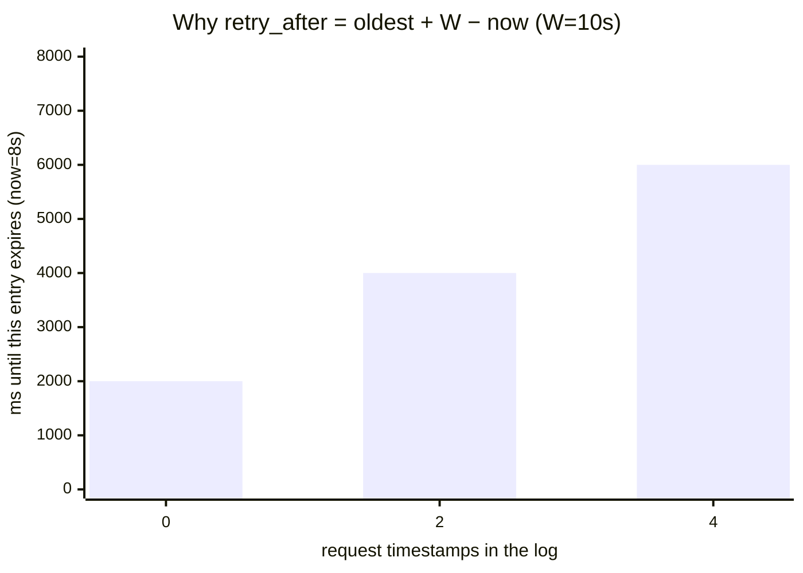
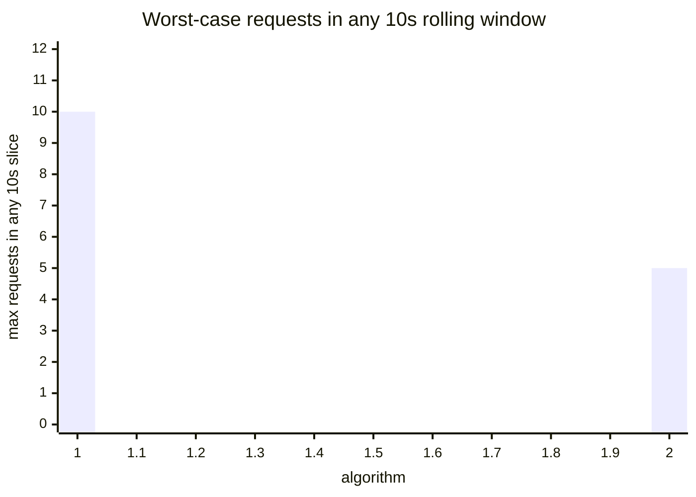
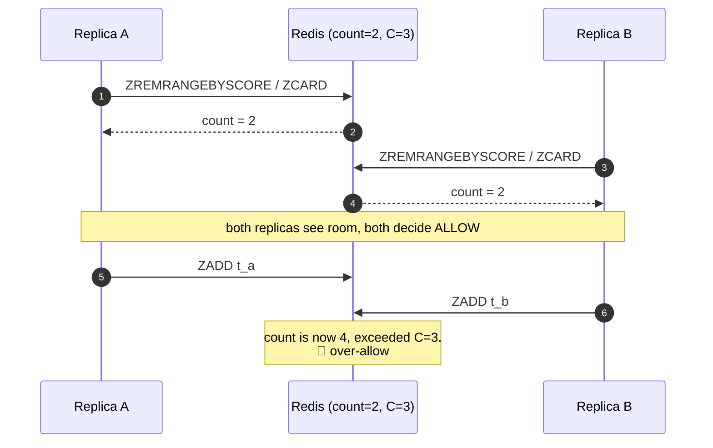
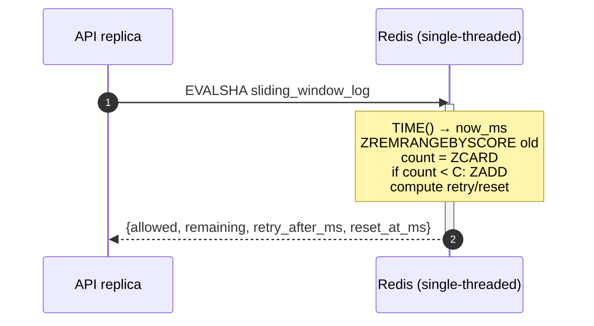

# Sliding Window Log

> The most accurate of the four. Stores the timestamp of every request in
> a sorted set, then on each new request drops anything older than
> `now − W` and counts what's left. Solves fixed-window's boundary burst
> at the cost of O(N) memory per active client.

---

## 1. The mental model

Instead of one counter per fixed time slice, we keep a **log** — a list of
exact request timestamps. The "window" is a sliding interval of length `W`
that always ends at *now*. A request is allowed iff the log contains
fewer than `C` entries inside that interval.



The key insight: the algorithm doesn't think about windows at all. It
thinks about *the most recent W seconds*. Every request redefines what
"window" means.

---

## 2. Visual: the log over time

`C = 3`, `W = 10s`. Each tick is a stored request timestamp; the green
band is the rolling 10-second window ending at *now*.



Reading the chart:
- `t=0..6`: 3 requests stored. ZCARD grows to 3, hits the limit.
- `t=6..10`: any new request would be **denied** (ZCARD == C, no room).
- `t=10`: the entry from `t=0` is now older than W → ZREMRANGEBYSCORE drops it → ZCARD falls to 2 → next request **allowed** and stored at `t=10`.
- `t=10..17`: log slides forward; old entries keep expiring as new ones arrive.



Notice there is no concept of "window flip." The log slides continuously.

---

## 3. The math, from first principles

### 3.1 The set, formally

State for one client is the set of timestamps (in ms):

$$S = \{ t_1, t_2, \dots, t_n \} \quad \text{where each } t_i \text{ is a request time}$$

Stored as a Redis **sorted set** with score = timestamp:

```
ZSET  rl:swl:<client>
  ├─ <unique-id-1>  score = t_1
  ├─ <unique-id-2>  score = t_2
  └─ ...
```

The members must be unique — two requests at the same millisecond would
collide and `ZADD` would deduplicate. We use `t_ms:counter` or a UUID as
the member; Lua generates it from `now_ms` plus a per-call sequence.

### 3.2 The window

At time `now`, the sliding window is the half-open interval:

$$\text{window} = (now - W,\ now]$$

The current count is:

$$\text{count} = |\{ t_i \in S : t_i > now - W \}|$$

In Redis terms: drop anything with score `≤ now - W`, then `ZCARD`:

```
ZREMRANGEBYSCORE key  0  (now - W)
count = ZCARD key
```

### 3.3 The decision

$$\text{allowed} = (\text{count} < C)$$

Note the strict `<`: we count *before* adding the new request. If
`count = 2` and `C = 3`, this is the third request, and we have room.
After adding, the log holds 3 entries.

If allowed, append:

```
ZADD key  now_ms  <unique-member>
```

**If denied, we do NOT add.** This is the opposite policy from fixed-window
(which INCRs even on denies). The reason is different:
- Fixed-window's counter is a coarse signal; INCRing on denial keeps the
  counter honest under load.
- Sliding-log's set IS the truth. Adding a denied request would push the
  effective rate above `C` for the next call (since now there are `C`
  entries inside the window when there should be `C-1` slots).

### 3.4 `remaining`, `retry_after_ms`, `reset_at_ms`

**Remaining** is straightforward:

$$\text{remaining} = \max(0,\ C - \text{count}_{\text{after}})$$

where `count_after` includes the just-added entry on allow, or equals the
pre-add count on deny.

**Retry-after** is the time until the *oldest* entry slides out of the
window — that's when a slot opens up:

$$\text{retry\_after\_ms} = (\text{oldest} + W) - now_{ms}$$



(The oldest entry, at `t=0`, expires soonest — at `t=10s`. Right now
`t=8s`, so `retry_after = 10 − 8 = 2s`. The other entries expire later
but are irrelevant to "when can I make my next call".)

**Reset** is when the log will be empty — when the *newest* entry expires:

$$\text{reset\_at\_ms} = \text{newest} + W$$

After this point, the log is guaranteed empty (assuming no further calls)
and the client has a full quota again.

### 3.5 Why this fixes the boundary-burst flaw

Compare to fixed-window. With `C=5, W=10s`:



(Left bar: fixed-window can pack `2C=10` requests into a 10s slice that
straddles a boundary. Right bar: sliding-log enforces `C=5` for *every*
10s slice, by definition.)

**Proof:** at any time `now`, the algorithm counts entries in `(now-W, now]`.
This count is bounded by `C` because we deny any request that would push
it past `C`. The bound holds for *every* possible value of `now`, so
there is no time interval of length `W` containing more than `C` requests.
The boundary effect is mathematically eliminated.

### 3.6 Memory cost

Where fixed-window uses **one integer per client per window**, sliding-log
uses **one sorted-set entry per request in the last W seconds**. For a
client at full throttle:

$$\text{memory}_{\text{client}} \approx C \cdot (\text{member size} + \text{score size}) \approx C \cdot (\sim 32\text{B})$$

Cluster-wide, this scales as `total_clients · avg_C`. For a service with
1M active clients each at `C=100`, that's ~3.2 GB just for rate-limit
state. Use this algorithm when **fairness matters more than memory**:
strict per-second SLAs, billing-sensitive APIs, write paths.

---

## 4. State on disk (Redis)

```
ZSET  rl:swl:<client>:<endpoint>
  ├─ member_1  score = t_ms_1
  ├─ member_2  score = t_ms_2
  └─ ...

PEXPIRE  W × 1000   # refreshed every call
```

**Why TTL is exactly `W` (refreshed on every call):**
- An entry older than `W` is dead weight — it gets pruned next time anyway.
- If the client goes silent, after `W` seconds *every* entry is expired.
  Letting the whole key disappear at that point saves the next call from
  doing a no-op `ZREMRANGEBYSCORE` on a stale set.
- We *do* refresh TTL each call (unlike fixed-window) because the set
  meaningfully exists as long as the client is active — there's no
  "boundary" to honor.

### Member uniqueness

`ZADD` deduplicates by member name. Two requests in the same millisecond
must be distinguishable, so we encode:

$$\text{member} = \texttt{<now\_ms>:<seq>}$$

where `seq` is a per-call counter the Lua script maintains. (Alternatively:
the Redis script can generate a member from `now_ms` plus a small random
suffix — same effect.)

---

## 5. Why Lua, why atomic

The decision is a multi-step chain — `ZREMRANGEBYSCORE → ZCARD → maybe ZADD`
— and the math depends on `now`. Without atomicity:



Lua collapses the whole chain to one atomic step:



The reason for this algorithm's existence — strict per-window correctness
— is *only* delivered by atomicity. A non-atomic implementation has every
problem fixed-window has, plus higher memory cost.

---

## 6. Walkthrough of the planned Lua script

```lua
local key      = KEYS[1]
local capacity = tonumber(ARGV[1])
local window_s = tonumber(ARGV[2])

local t = redis.call('TIME')
local now_ms = tonumber(t[1]) * 1000 + math.floor(tonumber(t[2]) / 1000)
local cutoff = now_ms - window_s * 1000

-- 1. Drop entries that have aged out of the window.
redis.call('ZREMRANGEBYSCORE', key, 0, cutoff)

-- 2. Count what's left and decide.
local count = redis.call('ZCARD', key)

local allowed        = 0
local retry_after_ms = 0
local reset_at_ms    = now_ms + window_s * 1000

if count < capacity then
    -- 3a. Allow: stamp this request into the log with a unique member.
    redis.call('ZADD', key, now_ms, now_ms .. ':' .. count)
    allowed = 1
    count = count + 1
    -- Reset = when the entry we just added expires.
    reset_at_ms = now_ms + window_s * 1000
else
    -- 3b. Deny: oldest entry's age tells us when a slot opens.
    local oldest = redis.call('ZRANGE', key, 0, 0, 'WITHSCORES')
    if #oldest >= 2 then
        local oldest_ms = tonumber(oldest[2])
        retry_after_ms = (oldest_ms + window_s * 1000) - now_ms
        if retry_after_ms < 0 then retry_after_ms = 0 end
    end
    -- Reset = when the newest entry expires (worst case for client).
    local newest = redis.call('ZRANGE', key, -1, -1, 'WITHSCORES')
    if #newest >= 2 then
        reset_at_ms = tonumber(newest[2]) + window_s * 1000
    end
end

redis.call('PEXPIRE', key, window_s * 1000)

local remaining = capacity - count
if remaining < 0 then remaining = 0 end

return {allowed, remaining, retry_after_ms, reset_at_ms}
```

| Step | What it does |
|---|---|
| `TIME()` | Single-source clock (same reasoning as the other algorithms) |
| `ZREMRANGEBYSCORE key 0 cutoff` | Drop everything strictly older than `now − W` |
| `ZCARD key` | Count what survived — that's how many requests fit in the current window |
| `count < capacity` | Strict `<` because we haven't added this request yet |
| `ZADD … now_ms .. ':' .. count` | Unique member; `count` works as the per-call sequence |
| `ZRANGE key 0 0 WITHSCORES` | Oldest entry → drives `retry_after_ms` |
| `ZRANGE key -1 -1 WITHSCORES` | Newest entry → drives `reset_at_ms` on deny |
| `PEXPIRE key W·1000` | Refresh TTL each call so an active client's set doesn't vanish mid-stream |

**Member format `now_ms .. ':' .. count`:** count is local to this call,
so within a single Lua execution two members can't collide. Across
sequential calls, `now_ms` differs (or `count` does — the set is
non-empty by definition when `count > 0`). This avoids needing a
separate counter key.

---

## 7. Comparison to the previous two algorithms

| Property | Token Bucket | Fixed Window | Sliding Window Log |
|---|---|---|---|
| Memory per client | 1 hash, 2 fields (constant) | 1 int, transient | **N entries** (N ≤ C in last W seconds) |
| Commands per request | ~3 internal | 2 internal | 3–5 internal |
| Long-run rate | `C / W` | `C / W` | `C / W` |
| Worst burst in any W-interval | `C` (smooth) | **`2C`** (boundary) | **`C` (provably tight)** |
| Returns `retry_after` based on | refill rate | window end | oldest log entry |
| Best for | bursty reads, search | hot paths needing simplicity | strict per-window SLAs, billing |
| Memory profile | O(clients) | O(active clients) | O(clients × C) |

Sliding-log is the **fairness gold standard** of the four, with memory
as the price.

---

## 8. Cheat sheet

| Quantity | Formula |
|---|---|
| Cutoff | `now_ms − W · 1000` |
| Prune | `ZREMRANGEBYSCORE key 0 cutoff` |
| Count | `ZCARD key` |
| Allowed | `count < C`  (strict, count is *before* add) |
| New member | `now_ms .. ':' .. count` |
| Retry-after (denied) | `oldest_ms + W·1000 − now_ms` |
| Reset (allowed) | `now_ms + W·1000` |
| Reset (denied) | `newest_ms + W·1000` |
| TTL | `W` seconds, **refreshed** every call |
| Worst case in any W-interval | `C` (no boundary effect) |
| Memory per client | `O(min(C, requests in last W))` |
