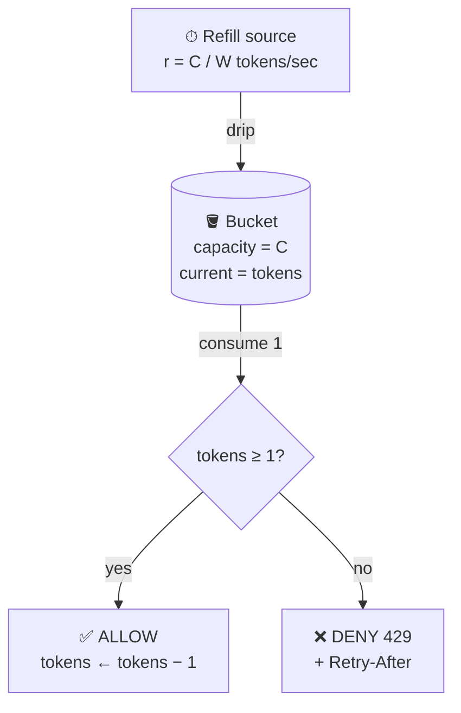
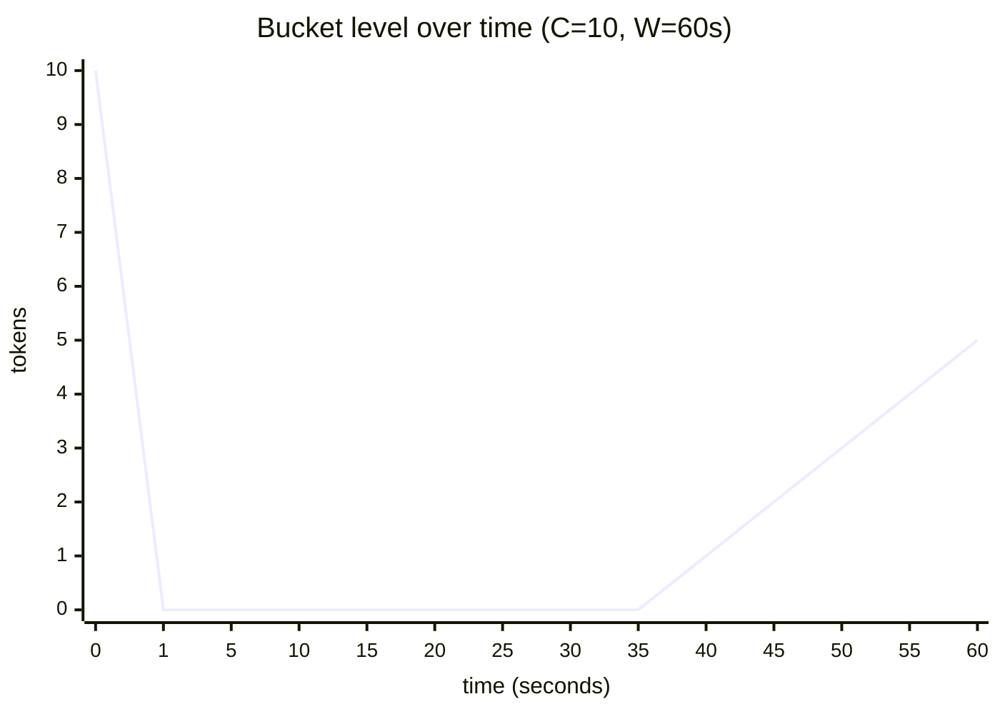
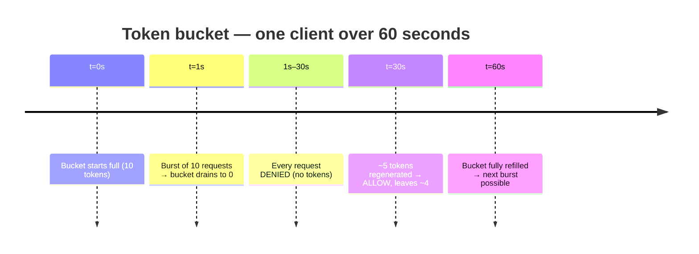
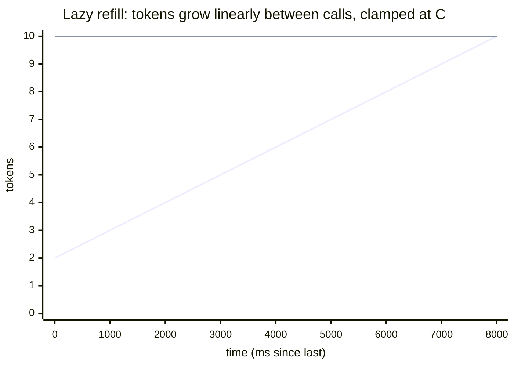
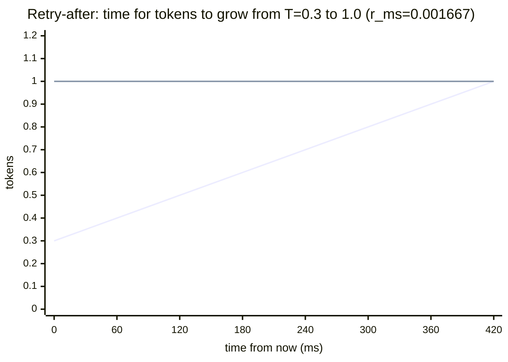
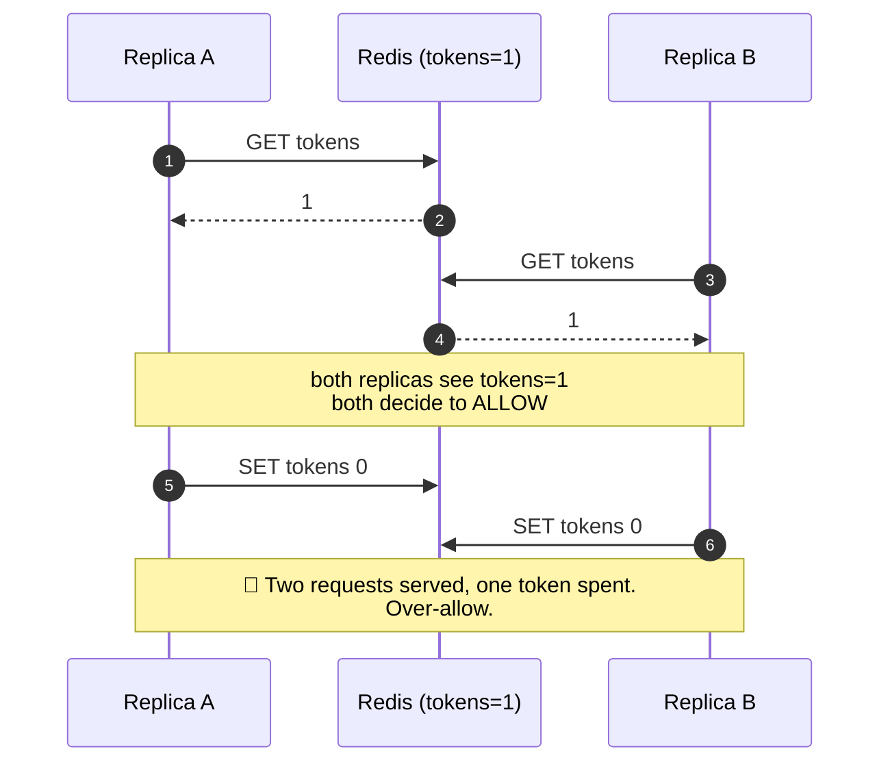
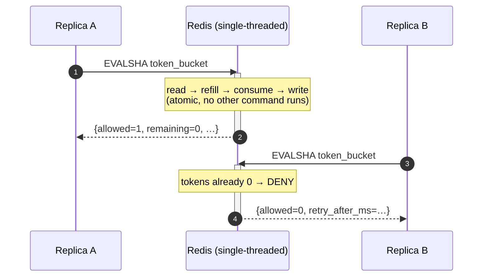

# Token Bucket

> Bursty-friendly rate limiting with a guaranteed long-run rate.
> Implemented as a single atomic Redis Lua script — no locks, no races.

---

## 1. The mental model

Imagine a **bucket** that holds at most `C` tokens.



Two things happen:

| Event             | Effect on the bucket                                    |
| ----------------- | ------------------------------------------------------- |
| Time passes       | Tokens trickle in at rate `r`, **capped** at `C`        |
| Request arrives   | If `tokens >= 1`: take one, **allow**. Else: **deny**.  |

That's the entire algorithm. Everything else is implementation detail.

---

## 2. Visual: a 60-second timeline

`C = 10`, `W = 60s`. Refill rate `r = 10/60 ≈ 0.167 tokens/sec` (one token every 6s).



Phases of the timeline:



Read it left to right:

1. `t=0`: bucket starts full (10 tokens).
2. `t≈1s`: client fires 10 requests fast → bucket drains to 0.
3. `t∈(1s, 30s)`: any request now is **denied** (no tokens).
4. `t=30s`: 29 seconds elapsed since last refill point → `29 × 0.167 ≈ 4.85` tokens regenerated. Request allowed, leaves `~3.85`.
5. `t=60s`: bucket fully refilled to capacity. Client can burst again.

**Two properties this picture proves:**
- **Burst**: up to `C` requests can land in the same instant.
- **Long-run cap**: averaged over time, throughput → `C / W` req/s. The bucket cannot manufacture tokens faster than `r`.

---

## 3. The math, from first principles

### 3.1 Refill rate

We promise the client: *"C requests per W seconds, on average."* So tokens must regenerate fast enough to refill the whole bucket in W seconds:

$$r = \frac{C}{W} \quad \text{tokens per second}$$

The Lua script works in **milliseconds** (Redis time has microsecond precision; ms keeps integer math clean):

$$r_{ms} = \frac{C}{W \cdot 1000} \quad \text{tokens per millisecond}$$

For `C=100, W=60`: `r_ms = 100 / 60000 ≈ 0.001667`.

### 3.2 Lazy refill — the integral trick

We do **not** run a background timer adding tokens. We store `last_refill_ms` and compute how many tokens to add **only when a request arrives**:

$$\Delta = (now - last) \cdot r_{ms}$$

$$\text{tokens}_{new} = \min(C,\ \text{tokens}_{old} + \Delta)$$

The refill is a straight line in `(time, tokens)` space, clamped at `C`:



(Lower line = actual refill from `tokens=2`. Upper flat line = capacity ceiling. They meet at `t ≈ 8s`, after which `min(C, …)` keeps the bucket pinned at 10.)

**Why this is exactly equivalent to a real-time drip:** a constant rate `r` over time `Δt` integrates to `r·Δt` tokens. The `min(C, …)` clamps overflow — being idle for an hour still gives you only `C` tokens, never more.

**The cost saving is enormous:** N idle clients cost zero CPU. Only requests trigger work.

### 3.3 The consume step

```
if tokens ≥ 1:
    tokens ← tokens − 1
    allowed ← true
else:
    allowed ← false
```

Note we work with **fractional** tokens internally (e.g. `0.7`). This matters: if 4 seconds have passed at `r_ms = 0.001`, we've regenerated `0.004` tokens — too few to allow, but they're banked for later. Storing tokens as integers would round these away and silently slow the long-run rate.

### 3.4 The `retry_after_ms` formula

A request is denied with `tokens = T` (where `T < 1`). When can the client safely retry?

We need `tokens` to grow from `T` to `1`. At rate `r_ms`:

$$\text{retry\_after\_ms} = \left\lceil \frac{1 - T}{r_{ms}} \right\rceil$$



The two lines cross at `t ≈ 420ms` — that is the smallest delay at which retrying succeeds.

**Why `ceil` (always round up)?** If we said "come back in 4199ms" and the client did exactly that, they'd find `tokens ≈ 0.9999` and get denied again — an infinite-deny loop with the client doing the right thing. Rounding up adds at most 1ms of unnecessary wait and guarantees the next attempt succeeds.

Worked example: `T = 0.3`, `r_ms = 0.001667` (C=100, W=60):

$$\text{retry\_after\_ms} = \lceil 0.7 / 0.001667 \rceil = \lceil 420 \rceil = 420 \text{ ms}$$

### 3.5 The `reset_at_ms` formula

A different question: when will the bucket be **completely full** again? This drives the `X-RateLimit-Reset` response header (informational — "your full quota returns at this timestamp").

Tokens missing = `C - T`. Time to refill them:

$$\text{reset\_at\_ms} = now + \left\lceil \frac{C - T}{r_{ms}} \right\rceil$$

Worked example: `now = 10000ms`, `T = 0.3`, `C = 100`, `r_ms = 0.001667`:

$$\text{reset\_at\_ms} = 10000 + \lceil 99.7 / 0.001667 \rceil = 10000 + 59820 = 69820 \text{ ms}$$

**Always `reset_at_ms - now ≥ retry_after_ms`** — filling the entire bucket takes at least as long as filling one slot.

### 3.6 Long-run guarantee (the proof)

**Claim:** over any interval of length `T_total` seconds, a single client's allowed requests are bounded by:

$$\text{requests} \leq T_{total} \cdot r + C$$

**Proof sketch:** the bucket generates tokens at rate `r` (steady drip). The most a client can store by being idle is `C` (the cap). Total tokens *available for consumption* in `T_total` is therefore at most `T_total · r + C`. Each request consumes exactly one token. Done.

For large `T_total`, the `T_total · r` term dominates, so:

$$\frac{\text{requests}}{T_{total}} \xrightarrow{T_{total} \to \infty} r = \frac{C}{W}$$

The `+ C` is the **burst allowance** — the deliberate price we pay for letting spiky clients through without artificial smoothing.

**Comparison to fixed-window:** a naive fixed-window counter can allow `2C` in one second at a window boundary (C right before the boundary, C right after). Token bucket's worst-case burst is `C`, predictable and bounded.

---

## 4. State on disk (Redis)

One **hash** per `(client, endpoint)` key. Two fields:

```
HASH  rl:tb:<client>:<endpoint>
  ├─ tokens          float    # may be fractional — do not round
  └─ last_refill_ms  int      # epoch ms of last update

PEXPIRE  2 × W × 1000   # auto-evict abandoned buckets
```

**TTL = `2W`** (in ms). Reasoning:
- A fully refilled bucket (`tokens = C`) is indistinguishable from a fresh one.
- After `W` seconds of idleness it's full → safe to drop after that.
- `2W` adds a safety margin; every active call refreshes the TTL via `PEXPIRE`.

**Net effect:** abandoned buckets self-clean; no cleanup cron needed.

---

## 5. Why Lua, why atomic

Naive Python flow: `GET tokens → compute → SET tokens`.



Classic **check-then-act race**. Both replicas read the same `1`, both decide to allow, both write `0`. We over-allowed.

The Lua version executes the same logic as a single, indivisible operation:



Redis is **single-threaded**: one command at a time. A Lua script runs to completion before any other command can interleave. So the read-modify-write sequence is atomic *by construction* — no locks, no Redlock, no CAS retry loops.

This is the central architectural reason the system can scale horizontally: every API replica talks to one Redis, and Redis serializes the decisions.

---

## 6. Why time comes from Redis, not Python

```lua
local t = redis.call('TIME')
local now_ms = tonumber(t[1]) * 1000 + math.floor(tonumber(t[2]) / 1000)
```

If we passed `time.time()` from the API process, two replicas with even **50ms of clock skew** would compute different `Δ` values for the same bucket — silent corruption of `tokens`. NTP keeps clocks close but never perfectly aligned.

`redis.call('TIME')` reads the **single** Redis server's clock. One source of truth. The sliding-window algorithm depends on this even more strictly; we adopt it project-wide for consistency.

---

## 7. Walkthrough of the Lua script

```lua
local key      = KEYS[1]
local capacity = tonumber(ARGV[1])
local window_s = tonumber(ARGV[2])
```
**Inputs.** `KEYS` and `ARGV` are how Redis hands params to a script. Numbers arrive as strings, hence `tonumber`.

```lua
local refill_per_ms = capacity / (window_s * 1000)
```
Section 3.1.

```lua
local t = redis.call('TIME')
local now_ms = tonumber(t[1]) * 1000 + math.floor(tonumber(t[2]) / 1000)
```
`TIME` returns `{seconds, microseconds}`. We convert to milliseconds. Section 6.

```lua
local state = redis.call('HMGET', key, 'tokens', 'last_refill_ms')
local tokens = tonumber(state[1])
local last   = tonumber(state[2])
```
One round trip to read both hash fields.

```lua
if tokens == nil then
    tokens = capacity
    last   = now_ms
else
    local elapsed = now_ms - last
    if elapsed > 0 then
        tokens = math.min(capacity, tokens + elapsed * refill_per_ms)
        last   = now_ms
    end
end
```
**First-sight branch:** brand-new client → start with a full bucket. Friendly default; never penalize a client we haven't met. **Existing branch:** lazy refill (Section 3.2).

```lua
local allowed        = 0
local retry_after_ms = 0
if tokens >= 1 then
    tokens  = tokens - 1
    allowed = 1
else
    retry_after_ms = math.ceil((1 - tokens) / refill_per_ms)
end
```
Sections 3.3 and 3.4.

```lua
local missing     = capacity - tokens
local reset_at_ms = now_ms + math.ceil(missing / refill_per_ms)
```
Section 3.5.

```lua
redis.call('HSET',   key, 'tokens', tokens, 'last_refill_ms', last)
redis.call('PEXPIRE', key, window_s * 2000)
```
Persist state. TTL refreshed every call (Section 4).

```lua
return {allowed, math.floor(tokens), retry_after_ms, reset_at_ms}
```
Four-element array → `Decision` dataclass on the Python side. `math.floor(tokens)` because clients want an integer remaining count, even though we store fractions internally.

---

## 8. Cheat sheet

| Quantity                    | Formula                                                |
| --------------------------- | ------------------------------------------------------ |
| Refill rate (per ms)        | `r_ms = C / (W · 1000)`                                |
| Tokens after refill         | `min(C, tokens + (now − last) · r_ms)`                 |
| Retry-after when denied     | `⌈(1 − tokens) / r_ms⌉`                                |
| Reset (bucket full again)   | `now + ⌈(C − tokens) / r_ms⌉`                          |
| Long-run rate               | `→ C / W` requests/second                              |
| Max burst                   | `C` requests in zero time                              |
| Bound over interval `T`     | `requests ≤ T · r + C`                                 |
| TTL                         | `2 · W` seconds (refreshed every call)                 |

Everything else in `token_bucket.lua` is plumbing around these formulas.
