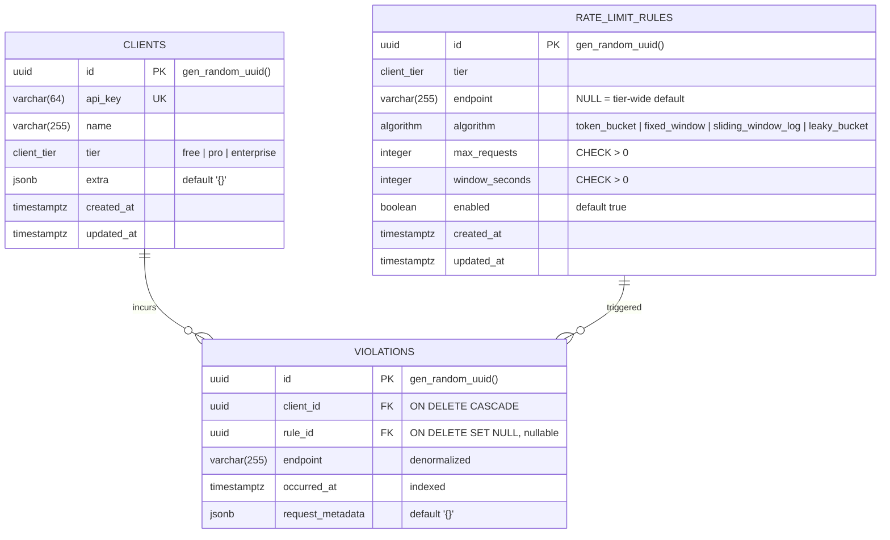

# Entity-Relationship Diagram

Source of truth for the control-plane schema. Hot path (Redis) is not modeled here — Postgres is only touched off the request path.

## Notes

- **`UNIQUE(tier, endpoint)`** on `rate_limit_rules` — `endpoint = NULL` is the tier-wide fallback. Postgres treats NULLs as distinct in UNIQUE, which is what we want (only one default per tier still works because there is at most one row with `endpoint IS NULL` per tier in practice; enforce via app-side check or partial unique index if needed later).
- **Soft delete is intentionally absent** on rules — `enabled=false` is the kill switch. Keeps queries simple and lets the worker re-sync to Redis cleanly.
- **`violations.endpoint` is denormalized** so audit rows survive rule deletion. `rule_id` goes NULL on delete rather than CASCADE for the same reason.
- **Postgres ENUM types** (`client_tier`, `algorithm`) are created once. Adding a value later requires an Alembic migration with `ALTER TYPE ... ADD VALUE` — non-trivial but stable for the lifetime of the project.
- **No `relationship()` calls** in the ORM yet. Added only when something actually traverses them.
